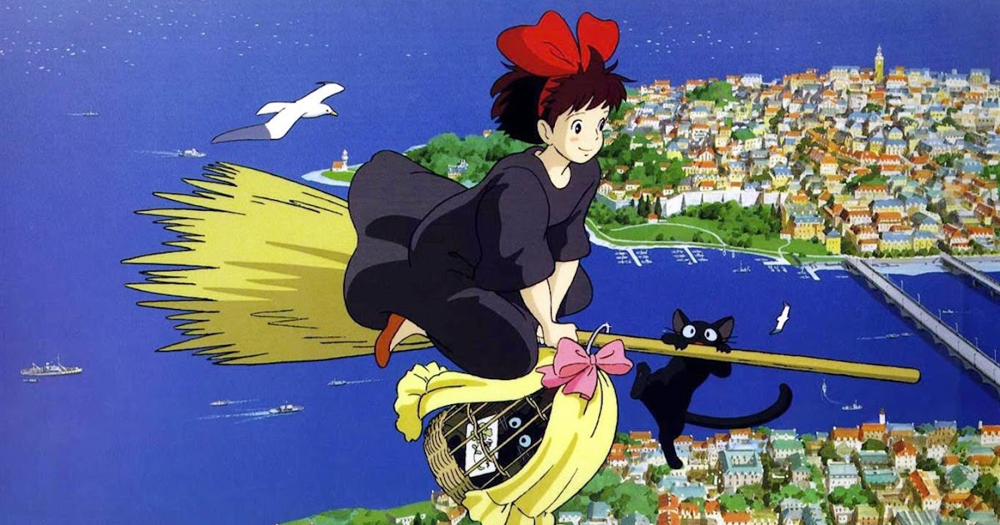
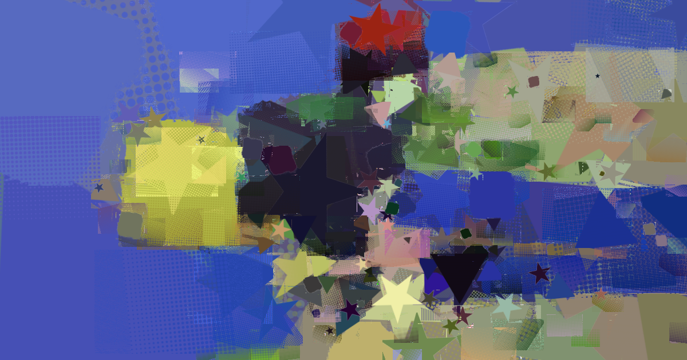
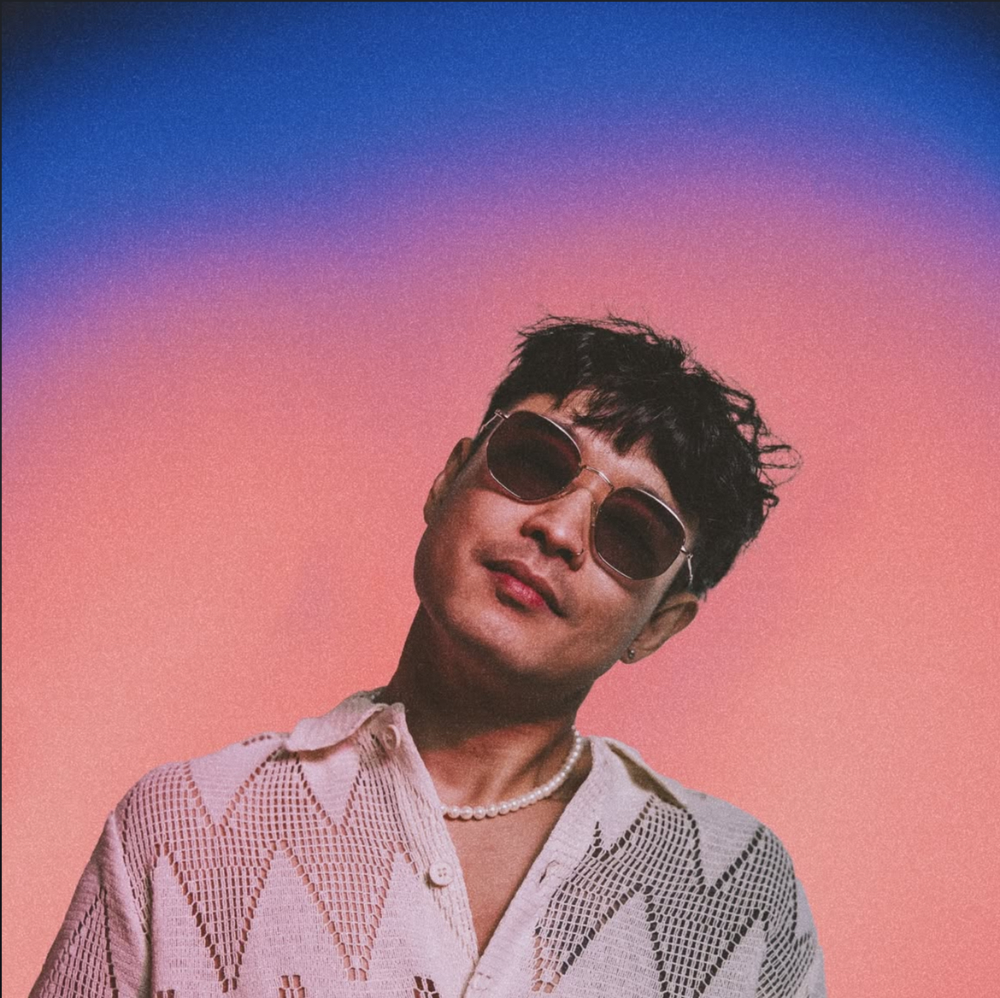
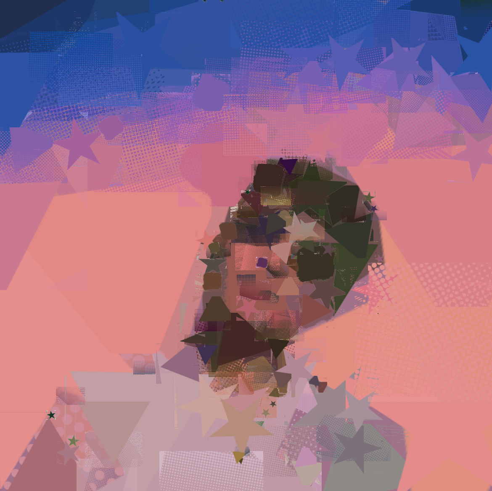

# Genetic Patch Image Approximator 
Using a genetic algorithm to modify the shapes, this project approximates an image with "patches" uploaded by the user, creating a "collage" effect. With more patches added to the collage, the collage approaches the target image.

## Demos
|**Original Image**           |**Reconstructed**                   |**Num Patches**|
| --------------------------- | ---------------------------------- | ------------- |
||| `350`         |
|          |          | `200`         |

## How to use

1. **Clone the repo**
```bash
git clone https://github.com/your-username/image-approximator.git
cd image-approximator
```
2. **Install requirements**
```bash
pip install -r requirements.txt
```
3. **Run the approximator**
_I've included the file `demo.ipynb` which describes a typical workflow._
- For Jupyter Notebook (recommended): Set `notebook = True` to view the image as it's generating.

## Features
- Custom patch sets (PNG with transparency)
- Optional recoloring and resizing
- Animation rendering (video of the build process)
- Fast evaluation via multithreading (ThreadPoolExecutor)


## Parameters
### `ImageApproximatorParameters`
| Parameter              | Description                                      | Default     |
| ---------------------- | ------------------------------------------------ | ----------- |
| `final_patch_pop_size` | Total number of patches to evolve                | 200         |
| `mutation_chance`      | Probability of gene mutation                     | 0.02        |
| `early_stop_patience`  | Stop evolving a patch if no progress for N steps | 15          |
| `start_mode`           | `'white'`, `'average'`, or path to an image      | `'average'` |
| `allow_angle`          | Enable rotation                                  | True        |
| `allow_resize`         | Enable dynamic patch size                        | True        |
| `allow_recolor`        | Enable RGB recoloring                            | True        |
| `make_animation`       | Save progress video                              | False       |

### `ImageApproximator.run(notebook=False, verbose=True)`
Runs the full image approximation pipeline.
| Parameter  | Description                                                        |
| ---------- | ------------------------------------------------------------------ |
| `notebook` | If `True`, displays image updates using `matplotlib` (for Jupyter) |
| `verbose`  | If `True`, prints status updates in terminal                       |

### `ImageApproximator.render_animation(filepath, fps=12)`
Exports the animation (if `make_animation = True`) as a video.
| Parameter  | Description                                      | Default |
| ---------- | ------------------------------------------------ | ------- |
| `filepath` | Path to save the output video (`.mp4` or `.avi`) | —       |
| `fps`      | Frames per second in the output video            | `12`    |